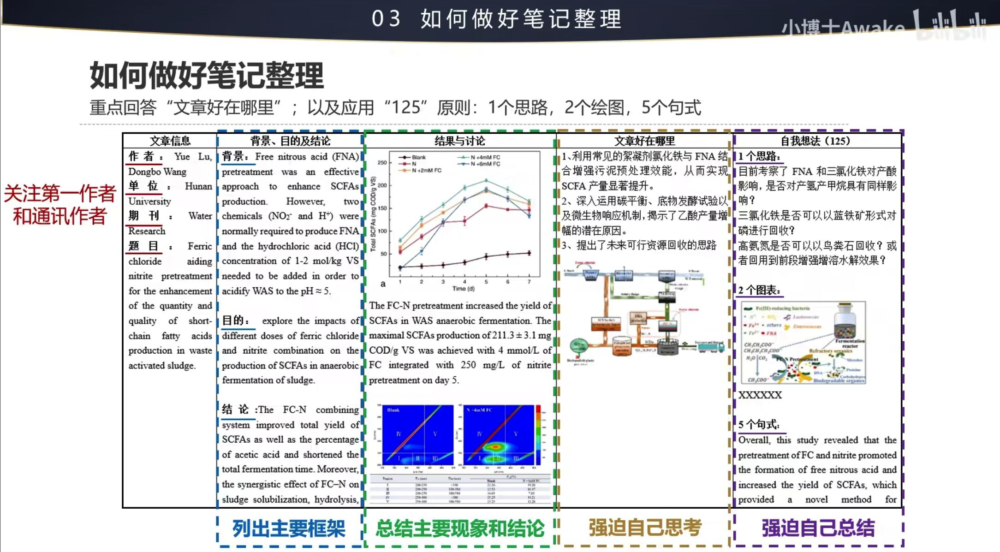

## Stork文献鸟
    通过输入研究方向关键词，设置提醒时间，文献鸟会定时将符合关键词的文献发送邮件

## Connected Papers
    通过输入文献名称或者DOI,可以获得与文献相关的论文知识图谱，追踪文献的引用和被引关系。
> 1. 论文发表时间越新，颜色越深
> 2. 论文引用度越高，圆圈越大
> 3. 论文之间联系越强，连线越黑

## 文献阅读笔记整理

## 文献分类
### 综述类文献

### 研究类文章

### 方法类文章

### 参考：[如何做好文献阅读及笔记整理](https://www.bilibili.com/video/BV17W4y167SM?vd_source=3d3b9bb859b089a6c1ae522354094dd1 "点击观看视频")